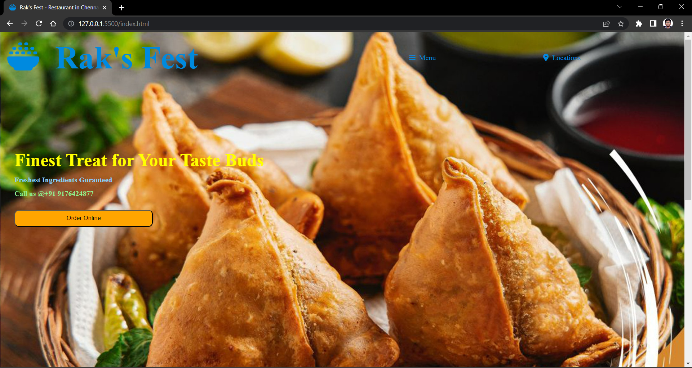
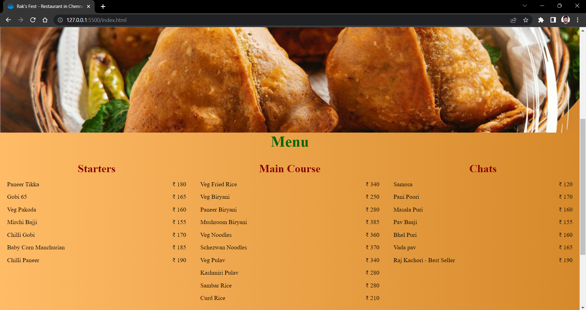
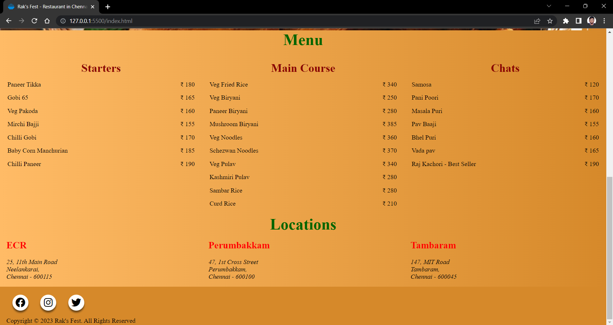

# BASIC RESTAURANT WEBSITE
## Introduction
* A restaurant website serves as a digital representation of a restaurant, providing information about its offerings, ambiance, and contact details. Building a restaurant website using HTML and CSS allows you to create an attractive and interactive online presence for the establishment.
* HTML (Hypertext Markup Language) forms the structure and content of web pages. It uses tags to define the elements of a webpage, such as headings, paragraphs, links, images, and navigation menus. CSS (Cascading Style Sheets) complements HTML by controlling the presentation and layout of web pages, including colors, fonts, spacing, and positioning.
* To begin the project, you'll start with the basic HTML structure. The HTML document starts with the `<!DOCTYPE html>` declaration, specifying the HTML version. The content goes inside the `<html>` tags, and the metadata, including the character encoding and viewport configuration, is defined within the `<head>` section.
* In the `<body>` section, you'll structure the website's elements. A common practice is to have a header that contains a navigation menu, allowing users to easily navigate through different pages. Each menu item is represented by an `<li>` (list item) element, and the menu itself can be structured using an unordered list (`<ul>`) with anchor tags (`<a>`) as links.
* The main content of the website is usually placed within the `<main>` tag. This section typically includes sections or divs that contain information about the restaurant, such as a hero section with an enticing image, a headline, and a brief description. You can also include other sections like a menu, about us, contact information, and testimonials, depending on the specific requirements of your project.
* At the end of the page, you can include a footer section that usually contains copyright information and links to relevant legal pages.
* CSS is used to style the HTML elements. By creating a separate CSS file or using inline styles, you can define properties like colors, fonts, margins, paddings, and more. Selectors are used to target specific HTML elements and apply the desired styles to them.
* Remember to organize your CSS code in a logical and modular manner to ensure easy maintenance and scalability. You can use classes and IDs to target specific elements or groups of elements and apply styles accordingly.
* By combining HTML's structure and CSS's presentation capabilities, you can create an engaging and visually appealing restaurant website that effectively showcases the restaurant's unique offerings and entices visitors to dine at the establishment.

## Screenshots

   
  Home

   
  Menu

   
  Locations

